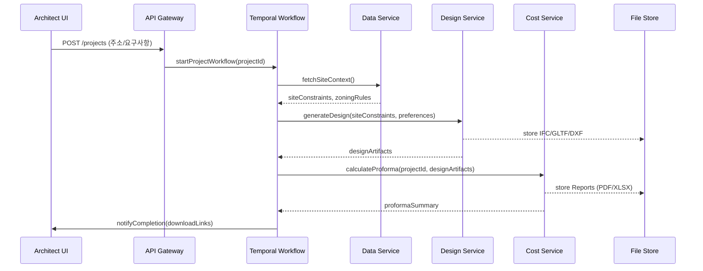

# 🏗️ 생명결 엔진 (LifeLine Engine)

주소 한 줄만 입력하면 30분 이내에 건축사 맞춤형 가설계 패키지를 생성해 주는 **건축사 개인화 AI 통합 플랫폼**의 MVP 사양서입니다. 이 문서는 실제 배포 가능한 수준의 제품을 3개월 내 구축한다는 가정으로 작성되었으며, 아키텍처 구성, 서비스 모듈, 데이터 모델, AI 파이프라인, 운영 전략을 시니어 개발자 시각에서 상세히 정의합니다.

---

## 0. 코드베이스 구조

```text
lifeline-engine/
├── README.md
├── pyproject.toml
├── lifeline_engine/
│   ├── __init__.py
│   ├── activities/
│   │   ├── compliance.py
│   │   ├── delivery.py
│   │   ├── design.py
│   │   ├── learning.py
│   │   ├── market.py
│   │   └── site_analyzer.py
│   ├── models/
│   │   └── domain.py
│   ├── services/
│   │   └── notifications.py
│   ├── utils/
│   │   ├── http.py
│   │   ├── logging.py
│   │   └── reference_data.py
│   ├── worker.py
│   └── workflows/
│       └── lifeline_workflow.py
├── tests/
│   └── test_workflow_structure.py
├── temporalio/ (테스트용 경량 스텁)
├── pydantic/ (테스트용 경량 스텁)
└── httpx/ (테스트용 경량 스텁)
```

## 1. 제품 개요

| 구분 | 내용 |
| --- | --- |
| **서비스명** | 생명결 엔진 (LifeLine Engine) |
| **핵심 고객** | 국내 등록 건축사 (약 20,000명), 중소형 디벨로퍼, 시공/자재 파트너 |
| **주요 가치 제안** | 주소 입력 → 30분 내 개인화 설계 패키지, 설계 DNA 기반 AI, 즉시 비용/사업성 분석 |
| **MVP 범위** | 주거/근린 생활시설 대상 가설계 패키지(평면/입면/매스/사업성 리포트) 자동 생성 |
| **성공 지표(KPI)** | 평균 설계 생성 시간 ≤ 30분, 재작업율 40% 감소, 사용자 NPS ≥ 60, 비용 추정 정확도 ±5% |
| **수익 모델** | 건축사 월 구독 + 프로젝트 기반 과금 + 파트너 매칭 수수료 |

---

## 2. 시스템 아키텍처 개요

```mermaid
C4Context
    title LifeLine Engine - Context
    Person(architect, "건축사", "주소·요구사항을 입력하고 설계 패키지를 수령")
    System(lifeline, "LifeLine Engine", "개인화 설계와 사업성 분석을 자동화")
    System_Ext(gov, "공공 데이터 API", "지적/법규/거래 정보 제공")
    System_Ext(market, "시장/자재 API", "분양, 임대료, 자재 단가")
    System_Ext(partner, "시공/금융 파트너", "견적, 금융 상품, 법무 서비스")

    architect --> lifeline: 주소/요구 입력, 피드백
    lifeline --> architect: 설계 패키지, 보고서, 추천
    lifeline --> gov: 데이터 수집
    lifeline --> market: 가격 정보 수집
    lifeline --> partner: 견적/금융 연동
```

### 계층 구조

| 레이어 | 주요 컴포넌트 | 기술 스택 |
| --- | --- | --- |
| **입력 & 오케스트레이션** | API Gateway, Auth/IAM, Workflow Orchestrator, Notification Service | AWS API Gateway, Cognito, Temporal, SNS/SQS |
| **도메인 마이크로서비스** | 프로젝트 서비스, 건축사 프로필 서비스, 설계 생성 서비스, 비용/사업성 서비스, 파트너 매칭 서비스 | FastAPI + Pydantic, gRPC/REST, PostgreSQL, Redis |
| **AI/데이터 플랫폼** | 데이터 수집 파이프라인, Feature Store, 모델 학습/서빙, 그래프 DB | Kafka Connect, Airflow, dbt, Delta Lake(S3+Glue), Feast, MLflow, Triton, Neo4j |
| **시각화/프런트** | 웹 대시보드, 프레젠테이션 뷰어, WebXR 뷰 | Next.js, React, Typescript, Three.js, Tailwind |
| **인프라 & DevOps** | IaC, Observability, CI/CD | Terraform, Kubernetes(EKS), Istio, Argo CD, Prometheus/Grafana, OpenTelemetry |

---

## 3. 서비스 모듈 상세

### 3.1 API Gateway & 인증
- JWT 기반 다중 테넌트 인증, Cognito + OIDC 연동
- 요청 서명 및 속도 제한 (건축사별 초당 5req)
- 감사 로그: CloudTrail + OpenSearch 저장

### 3.2 프로젝트 서비스
- 역할: 프로젝트 생성, 요구사항 관리, 결과 아카이빙
- 데이터 저장: PostgreSQL (projects, requirements, deliverables)
- 주요 API
  - `POST /projects` : 주소, 용도, 면적, 예산 입력 후 워크플로우 트리거
  - `GET /projects/{id}` : 상태, 생성된 도면/리포트 다운로드 링크
  - `POST /projects/{id}/feedback` : 건축사 피드백, 수정 요청 수집
- 이벤트
  - `ProjectCreated` → 워크플로우 엔진 → 데이터 수집 파이프라인 시작
  - `FeedbackSubmitted` → AI 지속 학습 큐

### 3.3 건축사 프로필 서비스
- 역할: 설계 DNA/스타일, 커뮤니케이션 패턴, 협력사 네트워크 관리
- 저장소: PostgreSQL + Feature Store + 벡터DB (pgvector)
- API
  - `GET /architects/{id}/profile`
  - `PUT /architects/{id}/style` : 설계 스타일 템플릿 업로드/수정
  - `GET /architects/{id}/recommendations` : 프로젝트별 템플릿 제안
- 배치 작업: 프로젝트 완료 시 벡터 임베딩 갱신

### 3.4 설계 생성 서비스
- 구성 서브모듈
  - **Site Analyzer** : 지적/법규 데이터 정규화, 제약조건 계산
  - **Massing Generator** : RL 기반 용적률/일조 최적화 → volumetric 모델
  - **Floorplan Synthesizer** : LLM+규칙 혼합으로 층별 평면 JSON (IFC 준수)
  - **Facade Composer** : 스타일 프로필 기반 입면 패턴 생성
- 출력 형식: IFC, SVG, GLTF, DWG(DXF 변환기 호출)
- 의존성: Neo4j (법규 그래프), Triton 서빙 (LLM/강화학습 모델)

### 3.5 비용 & 사업성 서비스
- 데이터: 자재 단가(실시간), 노무비, 금융 조건
- 알고리즘
  - 공사비 산출: 공종별 단가표 + 설계 물량 산정 (Quantity Take-off)
  - 사업성 분석: 시나리오 기반 NPV/IRR 계산, 민감도 분석
- API
  - `POST /projects/{id}/proforma`
  - `GET /projects/{id}/proforma/download` (PDF, XLSX)
- 파이프라인: 매일 자재/임대료 데이터 동기화 (Airflow)

### 3.6 파트너 매칭 서비스
- 파트너 메타데이터: 시공 품질 점수, 금융상품, 법무사 DB
- 추천 로직: 건축사 선호 + 프로젝트 속성 + 성과 점수 기반 랭킹
- 이벤트 구독: `ProjectStageUpdated` → 파트너 제안 푸시

### 3.7 Notification & Presentation
- 실시간 알림: Slack/Email/WebPush via SNS, custom webhook
- 프레젠테이션 패키지: Next.js SSR → PDF/웹 리포트, 3D Viewer (Three.js)

---

## 4. 데이터 모델

### 4.1 핵심 테이블 스키마 (PostgreSQL)

```sql
-- 건축사 프로필
CREATE TABLE architects (
    id UUID PRIMARY KEY,
    name TEXT NOT NULL,
    license_no TEXT UNIQUE NOT NULL,
    firm TEXT,
    preferences JSONB,
    communication_style JSONB,
    created_at TIMESTAMPTZ DEFAULT now(),
    updated_at TIMESTAMPTZ DEFAULT now()
);

-- 프로젝트
CREATE TABLE projects (
    id UUID PRIMARY KEY,
    architect_id UUID REFERENCES architects(id),
    address TEXT NOT NULL,
    latitude NUMERIC(9,6),
    longitude NUMERIC(9,6),
    program TEXT,
    gross_floor_area NUMERIC,
    budget NUMERIC,
    status TEXT CHECK (status IN ('pending','processing','completed','failed')),
    started_at TIMESTAMPTZ,
    completed_at TIMESTAMPTZ,
    metadata JSONB,
    created_at TIMESTAMPTZ DEFAULT now()
);

-- 요구사항
CREATE TABLE requirements (
    id UUID PRIMARY KEY,
    project_id UUID REFERENCES projects(id),
    category TEXT,
    payload JSONB,
    version INT DEFAULT 1,
    created_at TIMESTAMPTZ DEFAULT now()
);
```

### 4.2 데이터 레이크 영역
- **Raw Zone** : API 원본 JSON, GeoJSON, 이미지 타일 → S3 `raw/`
- **Curated Zone** : 정제된 Parquet (지적, 법규, 시장 데이터) → Glue Catalog 등록
- **Feature Zone** : 설계 DNA 벡터, 프로젝트 특징량 → Feast Feature Store
- **Model Registry** : MLflow로 학습 버전 관리, 모델 메트릭 저장

### 4.3 이벤트 스키마 (Kafka / EventBridge)

| 이벤트 | 필드 | 설명 |
| --- | --- | --- |
| `ProjectCreated` | `project_id`, `architect_id`, `address`, `program` | 새 프로젝트 요청 |
| `DataIngestionCompleted` | `project_id`, `site_constraints`, `zoning_rules` | 데이터 수집 완료 |
| `DesignGenerated` | `project_id`, `floorplans_uri`, `massing_uri` | 설계 생성 결과 |
| `CostAnalysisReady` | `project_id`, `summary`, `npv`, `irr` | 사업성 분석 완료 |
| `FeedbackSubmitted` | `project_id`, `rating`, `comments`, `revision_tags` | 학습 피드백 |

---

## 5. 핵심 워크플로우

### 5.1 주소 입력 → 설계 패키지 생성 (Temporal 워크플로우)



### 5.2 지속 학습 파이프라인

1. `FeedbackSubmitted` 이벤트 수신 → Feature Store 업데이트
2. dbt 모델로 프로젝트 결과/수익성 데이터 마트 구성
3. Ray Tune로 개인화 LLM 파인튜닝 (주 1회)
4. MLflow에 새 버전 등록, A/B 검증 후 Triton에 배포 (카나리 10%)

---

## 6. AI 모델 구성

| 모델 | 목적 | 입력 | 출력 | 주기 |
| --- | --- | --- | --- | --- |
| **LLM Planner (Instruction-tuned)** | 요구사항 해석 → 설계 브리프 생성 | 프로젝트 요구사항, 건축사 스타일 | 공간 프로그램 JSON | 실시간 |
| **Constraint Solver (CP-SAT)** | 법규/제약 최적 배치 | 부지 제약, 프로그램 JSON | 용적률/층수 배치안 | 실시간 |
| **Floorplan Generator (Diffusion + Rule)** | 층별 평면 생성 | 제약조건, 스타일 벡터 | 평면 셀 그래프, SVG | 실시간 |
| **Cost Estimator (Gradient Boosting)** | 공사비 추정 | 설계 물량, 시장 데이터 | 항목별 비용 | 실시간 |
| **Feedback Embedding Model (Siamese)** | 건축사 피드백 패턴 학습 | 수정 이력 텍스트 | 스타일 벡터 업데이트 | 배치 |

모델 서빙은 Triton + ONNXRuntime로 통합하며, GPU Auto-scaling(EKS Managed Node Group) 적용.

---

## 7. 인프라 & DevOps

### 7.1 환경 구성
- **개발/스테이징/프로덕션** 3단계
- 각 환경은 Terraform으로 VPC, EKS, RDS, S3, MSK(Kafka) 자동 생성
- Argo CD로 GitOps 파이프라인 구성, main 브랜치 머지 시 스테이징 → 승인 후 프로덕션 배포

### 7.2 관측성
- OpenTelemetry SDK → Tempo(Trace) + Loki(Log) + Prometheus(Metrics)
- 사용자 여정 대시보드: Grafana, 핵심 지표(응답시간, 성공률, 모델 추론 latency)
- 모델 모니터링: Evidently AI로 데이터 드리프트 감지, 슬랙 알림

### 7.3 운영 자동화
- SLA: 설계 생성 완료 30분 내 99% 달성
- SLO 모니터링: Temporal 워크플로우 duration, 모델 추론 실패율 < 0.5%
- Runbook: 장애 시 롤백(Argo Rollouts), 모델 버전 스위치(MLflow Registry)

---

## 8. 보안 & 컴플라이언스
- **데이터 분리**: 건축사별 프로젝트 데이터는 테넌트 ID 분리, Row Level Security 적용
- **암호화**: S3 버킷, RDS, Kafka 전송 모두 KMS 기반 암호화
- **접근 제어**: RBAC + ABAC, 관리자/건축사/파트너 권한 분리
- **감사 추적**: 모든 설계 생성 요청/결과를 Audit Trail에 저장 (7년 보관)
- **규제 대응**: 개인정보보호법, 건축법, 전자금융감독규정, ISMS-P 인증 로드맵

---

## 9. 배포 로드맵 (12주 MVP)

| 주차 | 마일스톤 | 산출물 |
| --- | --- | --- |
| 1-2 | 요구사항 확정, 데이터 소스 계약 | Product Spec, API 키, 보안 설계 |
| 3-4 | 데이터 수집/정제 파이프라인 구축 | Airflow DAG, S3 Raw/Curated, dbt 모델 |
| 5-6 | 핵심 마이크로서비스 개발 | 프로젝트/프로필/설계 서비스 API, Temporal 워크플로우 |
| 7-8 | AI 모델 통합 | LLM Planner, Floorplan Generator, Triton 서빙 |
| 9-10 | 비용/사업성 분석, 파트너 연동 | Proforma 엔진, 외부 견적 API 연결 |
| 11 | 프런트엔드 & 시각화 마감 | Next.js 대시보드, 3D 뷰어, 리포트 템플릿 |
| 12 | 보안 점검, 부하 테스트, 베타 런칭 | ISMS 체크리스트, Load Test Report, 베타 사용자 온보딩 |

---

## 10. 향후 확장 계획
1. **타입 확장**: 업무/숙박 등 다른 용도의 템플릿 추가
2. **자동 인허가 패키지**: 허가 제출 서류 자동화, 전자결재 연동
3. **시공 추적**: 공정 관리, IoT 센서 데이터 통합
4. **AI 마켓플레이스**: 외부 설계 모델/플러그인 입점, 수익 공유 모델

---

> 생명결 엔진은 건축사의 설계 역량을 증폭시키고, 프로젝트 초기 의사결정을 데이터 기반으로 전환하는 것을 목표로 합니다. 본 문서는 MVP를 신속히 배포하기 위한 기준 아키텍처로, 기능 확장 시 모듈 단위로 독립적 스케일링이 가능하도록 설계되었습니다.

---

## 7. Temporal 워크플로우 MVP 코드 구조

| 경로 | 설명 |
| --- | --- |
| `lifeline_engine/config.py` | 환경 변수 기반 설정과 Temporal 재시도 정책 정의 |
| `lifeline_engine/models/domain.py` | 주소, 제약조건, 시장 데이터, 산출물 등 공통 도메인 모델 |
| `lifeline_engine/activities/` | 단계별 Activity 구현 (Site Analyzer, Compliance, Market, Design, Learning, Delivery) |
| `lifeline_engine/workflows/lifeline_workflow.py` | 전체 파이프라인을 실행하는 Temporal Workflow (`lifeline_engine.main`) |
| `lifeline_engine/worker.py` | Temporal Worker 부트스트랩 (Task Queue: `lifeline-engine`) |
| `tests/test_workflow_structure.py` | 워크플로우/시그널/쿼리 존재 여부를 검증하는 구조적 테스트 |

### 로컬 실행 절차

1. Python 3.10 이상을 준비하고 가상 환경을 생성합니다.
   ```bash
   python -m venv .venv && source .venv/bin/activate
   ```
2. 의존성을 설치합니다.
   ```bash
   pip install -e .[dev]
   ```
3. Temporal 서버 주소, DB, S3 버킷 등의 환경 변수를 설정합니다.
   ```bash
   export LIFELINE_TEMPORAL_ADDRESS="temporal:7233"
   export LIFELINE_DATABASE_URL="postgresql+psycopg://user:pass@db/lifeline"
   export LIFELINE_OBJECT_STORAGE_BUCKET="lifeline-deliverables"
   export LIFELINE_KAFKA_BOOTSTRAP_SERVERS="kafka:9092"
   export LIFELINE_MODEL_REGISTRY_URI="http://mlflow:5000"
   ```
4. Temporal Worker를 실행합니다.
   ```bash
   python -m lifeline_engine.worker
   ```
5. 구조적 테스트를 실행하여 기본 배선이 올바른지 확인합니다.
   ```bash
   pytest
   ```

> 실제 API 연동, 모델 추론, 파일 업로드는 각 Activity 내부 TODO로 확장할 수 있으며, 재시도/폴백 정책은 Temporal Retry Options로 강화합니다.
